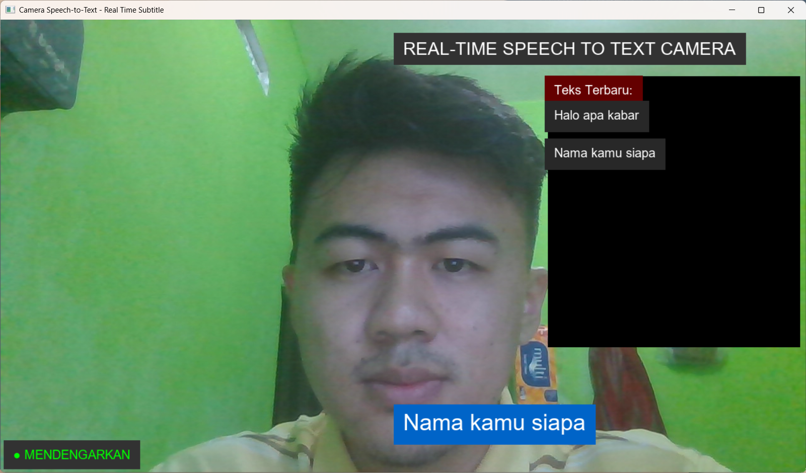
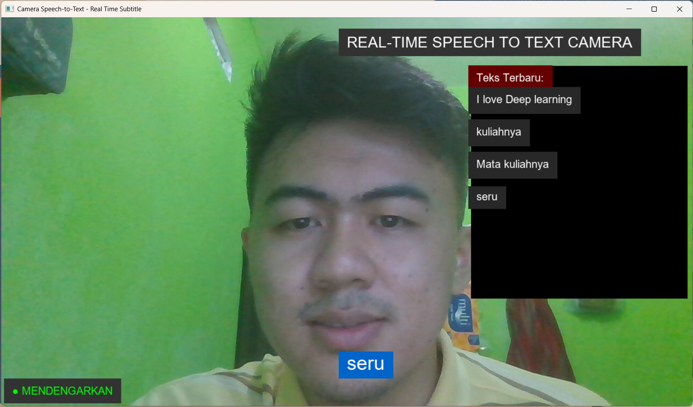
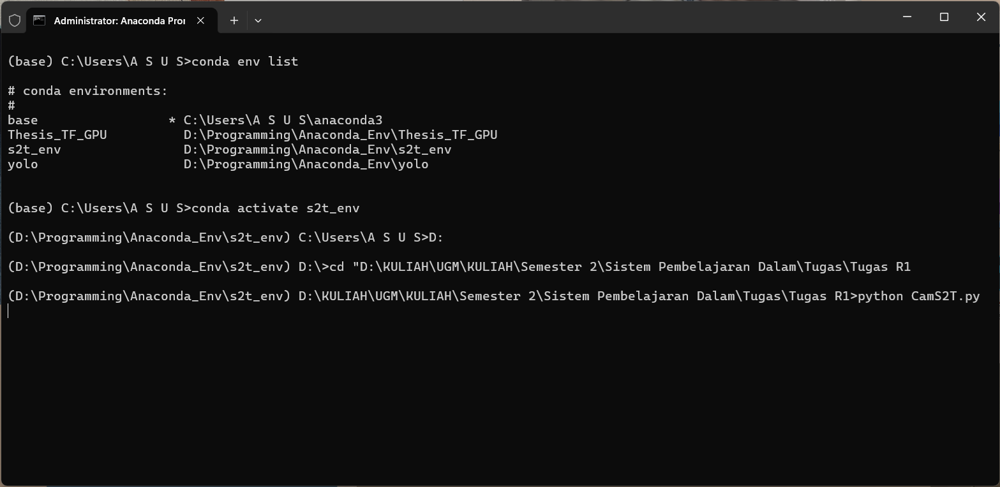

# 🎙️📹 Real-Time Multimodal Interface: Camera & Speech-to-Text (S2T)

**Author:** Regan Agam (NIM: 24/PTK/552177/16439)  
**Program:** Master's in Electrical Engineering, Universitas Gadjah Mada (UGM)  
**Course:** Sistem Pembelajaran Dalam (Deep Learning Systems)

## 📌 Project Overview
Deploying Deep Learning models into usable, real-time applications is a critical step in the AI development lifecycle. This project demonstrates a multimodal interface that seamlessly integrates live video capture (Camera) with real-time audio transcription (Speech-to-Text). 

The application is designed to capture voice input through a microphone, process it into text, and synchronize it with live camera feed operations, laying the groundwork for interactive AI assistants, automated subtitling systems, or accessibility tools.

## 🛠️ Tech Stack & Libraries
* **Language:** Python
* **Computer Vision:** `OpenCV` (Live camera feed handling and frame processing)
* **Audio Processing:** *(Tuliskan library yang Anda gunakan, misal: `SpeechRecognition`, `pyaudio`, atau model Deep Learning spesifik)*
* **Environment Management:** Custom environment testing scripts (`test_env.py`, `test_mic.py`)

## 📂 Repository Structure
* `app.py` - The main application script (formerly `CamS2T_v2.py`) containing the fully integrated Camera and S2T logic.
* `tests/` - Directory containing unit tests for microphone input (`test_mic.py`) and environment validation (`test_env.py`).
* `Regan Agam - Tugas SPD 1.pdf` - Comprehensive technical report detailing the system architecture and deep learning implementation.

## 📊 Application Demo & Interface
*(The following screenshots demonstrate the application's interface and successful speech transcription during live camera operation).*

### Live Integration


### Speech-to-Text Output



## 💡 Key Engineering Insights
* **Real-Time Processing:** Successfully managed the computational overhead of running video frame rendering and continuous audio listening concurrently without significant latency.
* **Multimodal Synchronization:** Solved the challenge of thread blocking (ensuring the camera feed doesn't freeze while the script waits for speech input) to create a smooth user experience.
* **Robust Hardware Interfacing:** Implemented dedicated microphone and environment testing scripts to ensure hardware compatibility before launching the main deep learning pipeline.

## 🚀 How to Run
1. Clone this repository:
   ```bash
   git clone [https://github.com/yourusername/realtime-multimodal-s2t-vision.git](https://github.com/yourusername/realtime-multimodal-s2t-vision.git)
